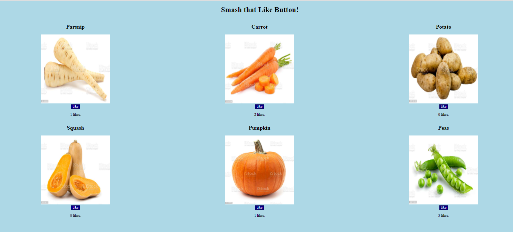

# PROG 2700 - Tech Check 4 

**Value:** 7.5% of overall course mark  
**Time to complete:** 1 hour

## Setup

Use the following command to install all necessary npm packages (not included in the GitHub repository) for the React application as stored in the package.json file:
**npm install**

When ready to run your application, type:
**npm start**

## React

Add a **Grid** component and a **Veggie** component to your React application. The Grid should create and render six Veggie components, much like the Tic-tac-toe Board did for the nine Squares. Using the data provided in the data.txt file as the starting **state** of your React application, build an application that displays the six Veggies with their images, followed by a Like button and count of current likes. When the Like button for a particular Veggie is clicked, update the Like count for that Veggie. Refer to the sampleOuput.png screenshot for an idea of what the application should look like.

### Requirements

You should make use of the provided src files (e.g. try to make use of the provided CSS, although you may need to modify the selectors based on the HTML structure your JSX creates). You will need to link your new Components in through App.js for the application to work.

### Important Note

There are no tests included with this Tech Check. Simply try to display a result similar to the following (from sampleOuput.png screenshot):

### Submission Instructions

Once your program is complete, or if you run out of in-class time to complete the Tech Check, commit and push your code to GitHub with the commit message "End of Class"

If you complete the Tech Check outside of class time, commit and push your subsequent code additions and changes with a message or "Ready for Marking"

### Marking Scheme
Final Grade | Requirement
:---: | ---
|**10/10** | Tech check is correct (matches desired output) and is completed within the allotted in-class time.
|**8/10** | Tech check is correct (matches desired output) and is completed within a 12-hour grace period beginning immediately following the end of in-class time.
|**6/10** | Tech check is correct (matches desired output) and is completed and submitted after the 12-hour grace period has elapsed.
|**0/10** | Tech check is not submitted or does not match desired output.
